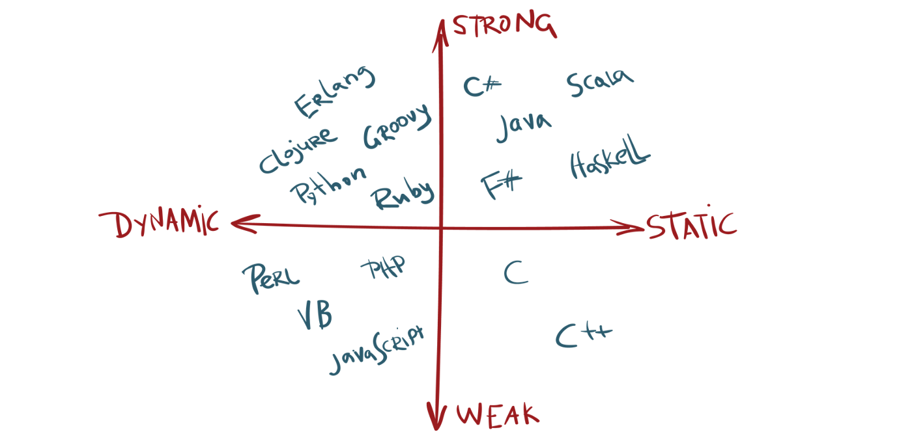

# [Statically vs Dynamically Typed Languages](https://android.jlelse.eu/magic-lies-here-statically-typed-vs-dynamically-typed-languages-d151c7f95e2b)

## Type Checking

Type checking is all about ensuring that the program is type-safe, minimizing the possibility of type errors. Type Checking may occur either at compile-time (a static check) or at run-time (dynamic check).

## 1. Static Typed Language

A language is statically-typed if the type of a variable is known at compile-time. Once a variable has been declared with a type, it cannot ever be assigned to some other variable of different type

> - A large class of errors are caught in the early stage of development process.
> - Static typing usually results in compiled code that executes more quickly because when the compiler knows the exact data types that are in use, it can produce optimized machine code (i.e. faster and/or using less memory).

## 2. Dynamically typed languages

A language is dynamically-typed if the type of a variable is checked during run-time. Variables are bound to objects at run-time by means of assignment statements, and it is possible to bind the same variables to objects of different types during the execution of the program.

### Advantages

> - Implementations of dynamically type-checked languages generally associate each run time object with a type tag (i.e., a reference to a type) containing its type information. This run-time type information (RTTI) can also be used to implement dynamic dispatch, late binding, down-casting, reflection, and similar features.
> - The absence of a separate compilation step means that you don’t have to wait for the compiler to finish before you can test your code changes. This makes the debug cycle much shorter and less cumbersome.

## 3. Strongly typed languages

A strongly-typed language is one in which variables are bound to specific data types, and will result in type errors if types do not match up as expected in the expression — regardless of when type checking occurs.

## 4. Weakly typed languages

A weakly-typed language on the other hand is a language in which variables are not bound to a specific data type; they still have a type, but type safety constraints are lower compared to strongly-typed languages.
